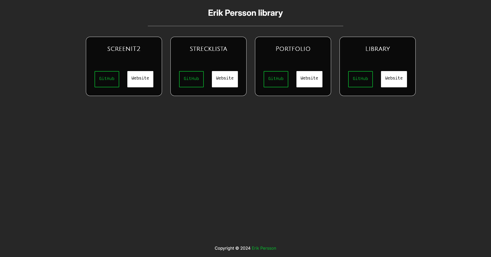
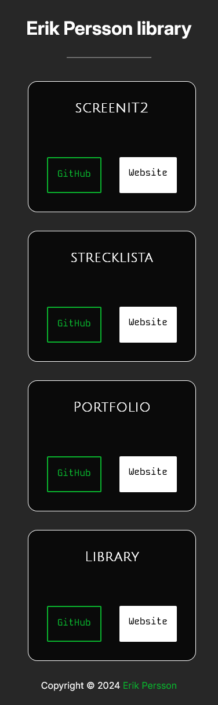

# library
[![Last Commit][last-commit-shield]][last-commit-url]
[![Repo Size][repo-size-shield]][repo-size-url]
[![Author][author-shield]][author-url]

## Project Overview
Library is a personal project of mine, designed to serve as a comprehensive showcase of my work and projects.


## Table of Contents
- [About the project](#about-the-project)
- [Features](#features)
- [Screenshots](#screenshots)
- [Built with](#built-with)
- [Getting started](#getting-started)

# About the Project

## Built with
![Vite][vite-shield]
![React][react-shield]
![TypeScript][typescript-shield]
![Docker][docker-shield]


## Screenshots



# Getting started

## Installation

1. Clone the repo
    ```sh
    git clone https://github.com/erikpersson0884/library
    ```

2. Install dependencies
    ```
    cd library

    npm run install
    ```

## Usage
After installation, you simply run the application with a single command.
```sh 
npm run dev
```

For production:
```sh
npm run build       # Build for production

npm start           # Run production website
```


<!--  CONFIG FOR README.md   -->

<!-- Repo info Shields -->
[last-commit-shield]: https://img.shields.io/github/last-commit/erikpersson0884/library/main?style=for-the-badge&cacheSeconds=30


[last-commit-url]: https://github.com/erikpersson0884/library/commits/main
[repo-size-shield]: https://img.shields.io/github/repo-size/erikpersson0884/library?style=for-the-badge&cacheSeconds=60
[repo-size-url]: https://github.com/erikpersson0884/library
[author-shield]: https://img.shields.io/badge/Author-Erik%20Persson-purple?style=for-the-badge
[author-url]: https://github.com/erikpersson0884
[stars-shield]: https://img.shields.io/github/stars/erikpersson0884/library?style=for-the-badge
[stars-url]: https://github.com/erikpersson0884/library/stargazers
[build-shield]: https://img.shields.io/github/actions/workflow/status/erikpersson0884/library/.github/workflows/build-and-push.yml?branch=main&style=for-the-badge
[build-url]: https://github.com/erikpersson0884/library/actions


<!-- Frameworks & Languages Shields -->
[vite-shield]: https://img.shields.io/badge/Vite-646CFF?logo=Vite&logoColor=white&style=for-the-badge
[react-shield]: https://img.shields.io/badge/React-61DAFB?logo=react&logoColor=white&style=for-the-badge
[next-shield]: https://img.shields.io/badge/Next.js-000000?logo=nextdotjs&logoColor=white&style=for-the-badge
[vitest-shield]: https://img.shields.io/badge/Vitest-3E7CFF?logo=vitest&logoColor=white&style=for-the-badge
[prisma-shield]: https://img.shields.io/badge/Prisma-3178C6?logo=prisma&logoColor=white&style=for-the-badge
[docker-shield]: https://img.shields.io/badge/Docker-2496ED?logo=docker&logoColor=white&style=for-the-badge
[typescript-shield]: https://img.shields.io/badge/TypeScript-3178C6?logo=typescript&logoColor=white&style=for-the-badge
[express-shield]: https://img.shields.io/badge/Express.js-000000?logo=express&logoColor=white&style=for-the-badge

